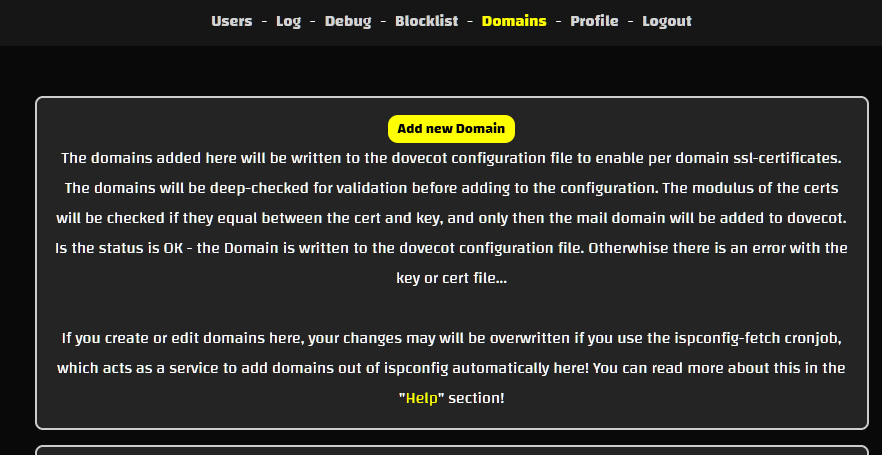

 

 

# Dovecot-Certificate-Interface [DCI]

For informations see the index.html file in the docs folder! You can open it with any webbrowser...

You can find the Documentation here:  
https://bugfishtm.github.io/Dovecot-Certificate-Interface/  

You can find the Github Page here:  
https://github.com/bugfishtm/Dovecot-Certificate-Interface  

My General Github Project Page is here:  
https://bugfishtm.github.io

## Example Image

## Issues
If you encounter issues or have questions using this software, do not hesitate write us at our Forum on www.bugfish.eu/forum !

## Default Login for Webinterface
Username: admin  
Passwort: changeme

----------------------------------------------------------------
more at www.bugfish.eu   
Made by Jan-Maurice Dahlmanns

